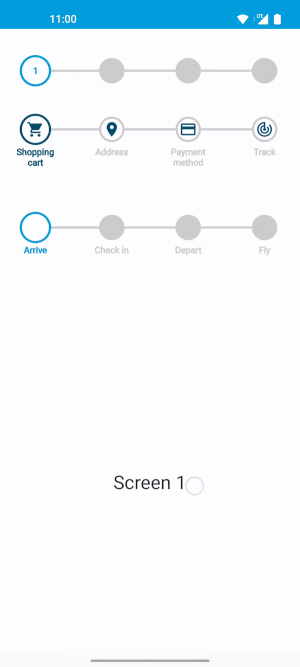

# Android step indicator

Dynamic step indicator library for Android. Fully customisable and compatible with ViewPager2.



## Download

Gradle is the only supported build configuration, so just add the dependency to your
project `build.gradle` file:

```groovy
dependencies {
    implementation 'nl.isaac:android-step-indicator:1.0.0'
}
```

This library supports only projects that have been migrated
to [androidx](https://developer.android.com/jetpack/androidx/). For more information, read
Google's [migration guide](https://developer.android.com/jetpack/androidx/migrate).

## Usage

Place the step indicator in your XML view.

```xml

<nl.isaac.android.StepIndicator 
    android:id="@+id/stepIndicator"
    android:layout_width="wrap_content" 
    android:layout_height="wrap_content"
    app:numberOfSteps="4" />
```

Add or change properties in your Activity of Fragment

```kotlin
private fun setupStepIndicator() {
    val stepIndicator: StepIndicator = findViewById(R.id.my_step_indicator)
    stepIndicator.apply {
        showLabels = true
        labels = listOf("Label 1", "Label 2", "Label 3", "Label 4")
        fillNextStep = false
        fillPreviousStep = true
    }
}
```

## Properties

| Name | Type | Description | Default
| ------------ | ------------- | ------------ |------------ |
| `stepRadius` | float | size of step | 42f
| `activeStepRadius` | float | size of active step | stepRadius * 1.25
| `stepWidth` | float | stroke of step | 8f
| `stepDistance` | float | distance between steps | 175f
| `numberOfSteps` | int | total number of steps in view | 4
| `activeStepPosition` | int | current active step | 0
| `showLabels` | boolean | show labels below step | false
| `labels` | list<string> | Label for each step | {}
| `stepType` | StepType.Numbers, StepType.None, StepType.text<list<string>>, StepType.Icon<List<Int>>, stepType.MixedList<Pair<StepIndicatorTypeMixedOption, Any>> | Label for each step | StepType.Numbers

## Styling

| Name | Type | Default
| ------------ | ------------- | ------------ |
| `activeStepColor` | color | primaryColor
| `previousStepColor` | color | primaryColor
| `nextStepColor` | color | Color.LTGRAY
| `activeStepIndicatorTypeColor` | color | primaryColor
| `previousStepIndicatorTypeColor` | color | primaryColor
| `nextStepIndicatorTypeColor` | color | Color.LTGRAY
| `activeStepLabelColor` | color | primaryColor
| `previousStepLabelColor` | color | primaryColor
| `nextStepLabelColor` | color | Color.LTGRAY
| `fillActiveStep` | boolean | false
| `fillPreviousStep` | boolean | false
| `fillNextStep` | boolean | true

## License
[MIT](LICENSE) © ISAAC Software Solutions BV
